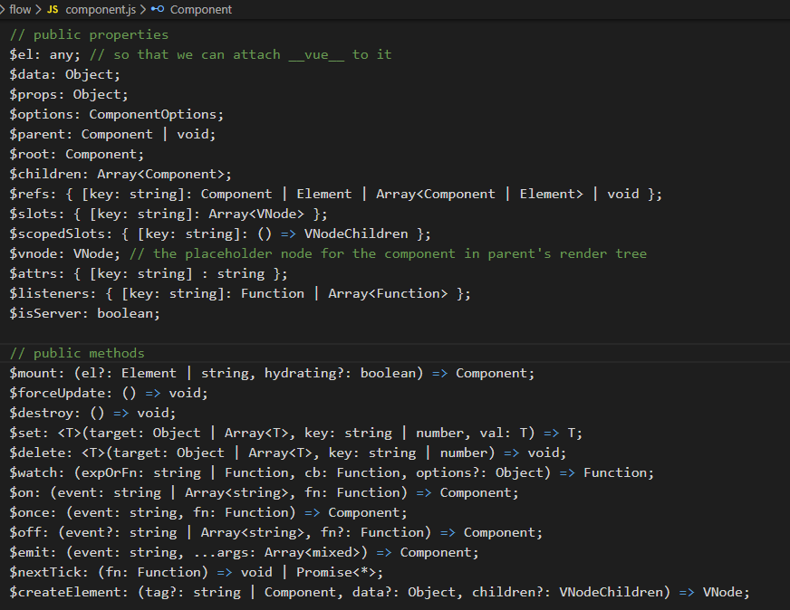

<h2 style="text-align:center;">原理概述&流程分析</h2> 
</br>
<p>created by <a href="https://blog.csdn.net/heroboyluck">hboot</a></p>
</br>

> `new Vue`都做了什么之数据的双向绑定、监听

传统的JS开发中使用`ajax`获取到数据后手动拼装结构加入到页面中，实现了页面的局部刷新。

`Vue`帮我们减少频繁的DOM操作，我们只需要关注处理数据，所有使用到这组数据的地方都会自动更新。

## `new Vue`之前做了什么

在我们还没有使用实例化一个`new Vue`对象时，内部已经做了一些事情。

> 为了说明会摘抄部分代码。`**Mixin`后缀说明了实在扩充`Vue`方法、属性。

1. 在`Vue`原型链上绑定`_init`方法。

    摘自`vue-2.6.11\src\core\instance\init.js`

    ```js
    export function initMixin (Vue: Class<Component>) {
        Vue.prototype._init = function (options?: Object) {
            // ...
        }
    }
    ```

2. 绑定处理`Vue`数据源的属性、方法,包括`$data`/`$props`/`$set`/`$delete`/`$watch`,这些都是在当前Vue实例中数据改变的源头。

    摘自`vue-2.6.11\src\core\instance\state.js`

    ```js
    Object.defineProperty(Vue.prototype, '$data', dataDef);
    Object.defineProperty(Vue.prototype, '$props', propsDef);

    Vue.prototype.$set = set
    Vue.prototype.$delete = del
    Vue.prototype.$watch = function();
    ```
3. 绑定处理`Vue`自定义事件的方法，包括`$on`/`$once`/`$off`/`$emit`.
    
    摘自`vue-2.6.11\src\core\instance\events.js`
    ```js
    Vue.prototype.$on = function(){};
    Vue.prototype.$once = function(){}
    Vue.prototype.$off = function(){}
    Vue.prototype.$emit = function(){}
    ```
4. 处理`Vue`实例更新,手动调用方法执行。`$forceUpdate`/`$destroy`
    
    摘自`vue-2.6.11\src\core\instance\lifecycle.js`

    ```js
    // 内部调用节点更新的方法
    Vue.prototype._update = function(){};
    // 手动调用更新实例
    Vue.prototype.$forceUpdate = function(){};
    // 销毁实例，清楚与其他实例的连接、解绑指令、事件。
    Vue.prototype.$destroy = function () {};
    ```
5. 实例挂载后,页面元素可用。`$nextTick`
    摘自`vue-2.6.11\src\core\instance\render.js`
    ```js
    // 手动调用页面更新，回调可获取页面元素进行DOM操作
    Vue.prototype.$nextTick = function () {};
    // 调用`$mount`返回解析后的文档，手动挂载到页面
    Vue.prototype._render = function(){};
    ```

摘自`vue-2.6.11\src\core\instance\index.js`

```js
function Vue (options) {
  if (process.env.NODE_ENV !== 'production' &&
    !(this instanceof Vue)
  ) {
    warn('Vue is a constructor and should be called with the `new` keyword')
  }
  this._init(options)
}

initMixin(Vue)            // 初始化方法
stateMixin(Vue)       // 数据对象、属性
eventsMixin(Vue)       // 自定义事件方法
lifecycleMixin(Vue)        // 生命周期
renderMixin(Vue)        // VNode解析，渲染
```

这些与`new Vue`时参数属性不相关的提前提前初始化。

## `new Vue`做了什么

上面一章节说了实例化之前的工作，那我们在使用时的流程是什么。

这是一个标准的实例化`new Vue`；

```js
new Vue({
    el:"#app",
    props:[],
    data:function()=>{
        return {
            name:"admin"
        }
    },
    beforeCreate:function(){
        // 实例创建后，数据还未绑定监听
    },
    created:function(){
        // 实例创建完成，完成数据绑定检测。还未挂载
    },
    beforeMount:function(){
        // 挂载之前调用，模板、VNode解析
    },
    mounted:function(){
        // 实例被挂载，视图渲染完毕。不保证子组件挂载
    },
    computed:{
        // 计算属性,缓存
    },
    methods:{
        getName:function(){
            return this.name;
        }
    },
    watch:{
        // 侦听属性
    },
    beforeUpdate:function(){
        // 数据更新后，视图还未渲染。可访问更新之前的DOM
    },
    updated:function(){
        // 数据更新后，视图也更新完毕。不保证子组件更新
    },
    beforeDestroy:function(){
        // 实例销毁之前，实例仍可用
    },
    destroy:function(){
        // 销毁实例，移除所有已关联的实例，解绑指令、事件。
    }
});
```

当实例化`new Vue()`时，可以看到调用了`this._init()`方法，并将参数`options`传入。

方法中第一行,JS 类型检查:
指定了`Vue`实例的类型为`Component`，定义了实例上所有的属性、方法。

`const vm: Component = this`



除了公共的属性、方法外还有内部用于数据流转处理的私有属性、方法。以`_**`方式命名。

执行流程，真个内部同步`vm`处理数据：

1. 合并属性使得通过`this.$options`可以访问到Vue实例的属性、方法。
    ```js
    vm.$options = mergeOptions(
        resolveConstructorOptions(vm.constructor),
        options || {},
        vm
        )
    ```
2. 初始化生命周期。
    ```js
    
    ```

3. 初始化事件

4. 初始化解析DOM树

5. 调用`deforeCreate`函数。

6. 初始化依赖注入。

6. 初始化数据状态，进行数据源的观测、绑定。

7. 初始化需要注入依赖的属性。

7. 调用`created`钩子函数。

8. 如果提供了`el`参数，则调用`$mount`进行挂载。