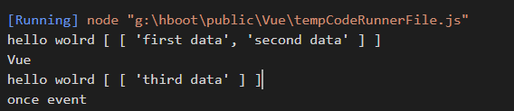

<h2 style="text-align:center;">实现Vue事件机制</h2> 

</br>
<p>created by <a href="https://blog.csdn.net/heroboyluck">hboot</a></p>
</br>

> 使用观察者模式实现Vue的事件监听绑定

Vue事件处理中总共有四种方法提供操作：`$on`/`$off`/`$emit`/`$once`

### 事件机制

监听事件：记录事件名称以及事件回调函数。

分发事件：查询记录找到分发的事件名称对象，遍历回调函数集合并执行回调函数。

移除事件：找到对应的事件记录，清除对象。

代码结构：

```js
function event(){
    this._events = {};
} 
event.propototype = function(){
    $on:function(){

    },
    $off:function(){

    },
    $emit:function(){

    },
    $once:function(){

    }
}
```
#### `$on`
说明：

* 第一参数为事件名称，接收数组多个事件绑定。
* 查询事件对象记录，是否有该事件的集合
* 将回调加入对应集合中。
```js
$on:function(types,fn){
    // 事件监听
    if(Array.isArray(types)){
        types.forEach(item=>this.$on(item,fn));
    }
    let listeners = this._events[types]; 
    if(!listeners){
        this._events[types]=[]
    }
    this._events[types].push(fn);
}
```
#### `$emit`
说明:

* 事件分发，如果对应的事件名称对象存在，则遍历执行它的回调函数集合。事件名称之后的参数作为回调函数的参数传递。

```js
$emit:function(types){
    // 事件发送
    if(Array.isArray(types)){
        types.forEach(item=>this.$emit(item));
    }
    let listeners =this._events[types];
    if(listeners){
        listeners.forEach(fn=>fn.call(this,[...arguments].splice(1)));
    }
}
```

#### `$off`
说明：

* 如果需要解除的事件不存在，则直接返回。
* 如果需要解除的事件回调函数不存在，清除事件记录中的事件名称对象。
* 传递了回调函数，遍历查找与回调函数相同的把他移除。

```js
$off:function(types,fn){
    // 事件解绑
    if(Array.isArray(types)){
        types.forEach(item=>this.$off(item,fn));
    }
    let listeners = this._events[types];
    if(!listeners){
        return;
    }
    if(!fn){
        this._events[types] = null;
        return;
    }
    let len = listeners.length;
    for(let i=len-1;i>-1;i--){
        if(listeners[i] === fn||listeners[i].fn === fn){
            listeners.splice(i,1);
        }
    }
}
```
#### `$once`
说明：

事件监听执行一次后，自动解除。

* 重新定义回调函数`on`, 
* 在执行回掉函数的时候，先解除绑定，然后执行一次原回调函数。

在自动解除绑定的时候，回到函数是`on`,所以对应的是`listeners[i] === fn`
在手动接触绑定的时候，回调是`fn` , 所以匹配`listeners[i].fn === fn`

```js
$once:function(types,fn){
    // 事件监听一次
    let $this = this;
    if(Array.isArray(types)){
        types.forEach(item=>this.$once(item,fn));;
    }
    function on(){
        $this.$off(types,on);
        fn.apply(this,arguments);
    }
    on.fn = fn;
    this.$on(types,on);
}
```

对比之前写的JS设计模式的文章：

[JS 设计模式 - 工厂模式、单例模式、观察者模式](https://blog.csdn.net/heroboyluck/article/details/89056022)

测试：
```js
let myEvent = new event();
myEvent.$on('hello',function(){
    console.log('hello wolrd',[...arguments]);
});
function print(){
    console.log("Vue");
}
myEvent.$on('hello',print);
myEvent.$emit('hello',"first data","second data");
myEvent.$off('hello',print);
myEvent.$emit('hello',"third data");
// once
myEvent.$once("world",function(){
    console.log('once event');
});
myEvent.$emit("world");
myEvent.$emit("world");
```
结果：

